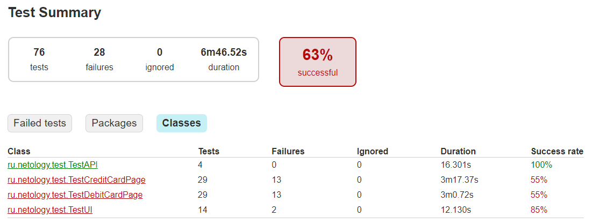
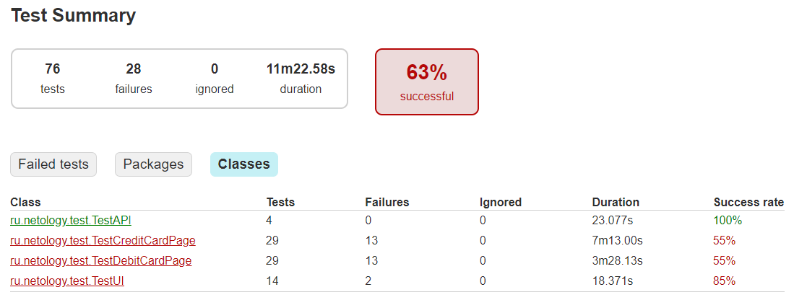

# Отчёт по итогам тестирования

### Краткое описание:

В рамках данного проекта стояла задача - автоматизировать тестирование комплексного сервиса покупки тура, взаимодействующего с двумя СУБД (_PostgreSQL и MySQL_) и API банка.  

Приложение представляет собой веб-сервис, через который можно приобрести тур по определённой цене двумя способами:

1. Обычная оплата по дебетовой карте;
2. Уникальная технология: выдача кредита по данным банковской карты.

### Этапы работы в рамках данного проекта:

* Проведено исследовательское, мануальное тестирование и составлен план автоматизации;
* Произведена автоматизация тестовых сценариев;
* Составлены отчеты о проведенном тестировании.

### Статистика прохождения тест-кейсов:

* Общее количество тест-кейсов: 76
* Количество оформленных баг-репортов: 19

**Отчет автотестов Gradle при подключении к MySql:**

* Всего тест-кейсов: 76
* Успешных: 48
* Неуспешных: 28

**Отчет автотестов Gradle при подключении к PostgreSQL:**

* Всего тест-кейсов: 76
* Успешных: 48
* Неуспешных: 28

### Общие рекомендации:

1. Необходимо разработать ТЗ и документацию;
2. Внедрить в код уникальные css-селекторы;
3. Исправить орфографическую ошибку на главной странице сервиса в слове "Марракеш";
4. Исправить название вкладки на "Покупка тура";
5. Исправить дефекты, связанные с неверными сообщениями об ошибках;
6. Исправить сообщение об успешности покупки в случае отклонения операции покупки;
7. Для поля "Владелец" добавить ограничение на использование исключительно латинской раскладки;
8. Сделать кнопку "Продолжить" неактивной, если есть пустые и/или неправильно заполненные поля.

_Полный список обнаруженных дефектов находится в **issues**._

###### P.S.: прошу принимать нулевое значение (*000*) в поле `CVC/CVV` за валидные данные, т.к. после изучения вопроса понял, что такое значение на картах российских банков вполне допустимо.
